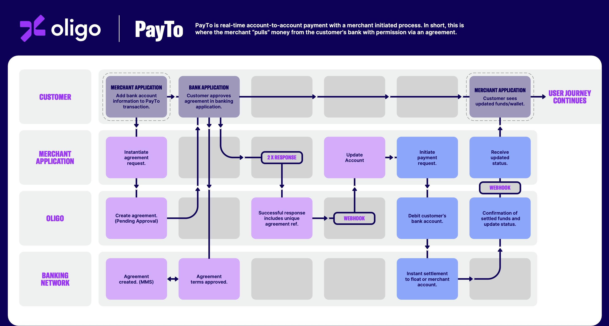
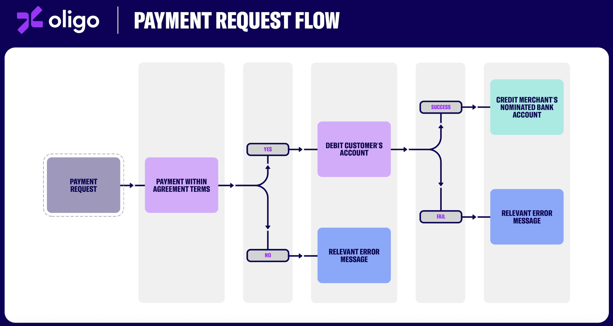

# Oligo PayTo API Overview

PayTo is a real-time payment mechanism that allows businesses to initiate payments from customer bank accounts using secure agreements.

---

## 📘 Introduction

Oligo PayTo lets you create **agreements** with customers and trigger **payments** based on those agreements.

You must first create an agreement, then initiate payments against that agreement.

---

## 🔐 Authentication

All API calls must include an Authorization header and content type set to JSON:

```
authorization: Bearer <access_token>
content-type: application/json
```

You will receive the access_token after signing contract with Oligo.

---

## Environments
We have 2 environments for testing and production:
- **Sandbox**: `https://api-sandbox.oligo.com.au/v1`
- **Production**: `https://api-prod.oligo.com.au/v1`

## High level workflow


## Payment flow



## 📄 The main endpoints you might use for the first integration

### 1. Create PayTo Agreement

Once you sign the contract with Oligo and get the access_token, you can create a PayTo agreement to start with your customer.

### 2. Check Agreement Status

The agreement will need the customer's authorization before it can be used for payments. So we need to check the status of the agreement after it has been created. Generally there are 2 ways to do this:
- Poll the agreement status using the `GET /payto/agreements/<your_agreement_uid>` endpoint.
- Or listen to the webhook event `payto_agreement.*` to get notified about the agreement status changes.

### 3. Initiate PayTo Payment

After the agreement is authorized from the customer's bank account, you can initiate a payment against that agreement.
This allows you to charge the customer based on the terms defined in the agreement.

### 4. Check Payment Status

Once a payment is initiated, you can check its status using the `GET /payto/payments/<your_payment_uid>` endpoint.
Or you can listen to the webhook event `payto_payment.*` to get notified about the payment status changes.

### 5. Webhooks

Oligo notifies your server about changes to agreement or payment status via [webhooks](../payto-webhook.md).
You can initialize your webhook by providing your own POST webhook endpoint to Oligo for either sandbox or prod.
